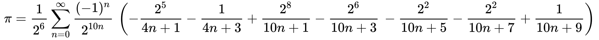
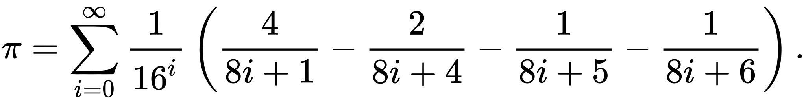
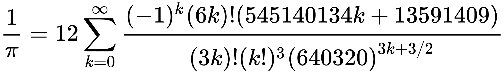

# Practice

## Description

This repository contains some simple scripts I made just to improve my programming skills. Also there are solutions for common interview questions.

## Scripts

### 1. [calculate_Pi.py](./scripts/calculate_Pi.py)

This script contains three functions to calculate Pi. Scripts measures time evaluated to calculate n numbers of Pi using different functions. I used three formulas:

1. Bellard's formula:

2. Bailey-Borwein-Plouff formula:

3. Chudnovsky formula:

### 2. [crypto_numbers.py](./scripts/crypto_numbers.py)

This script contains useful functions I used for my cryptography related projects such as generating random prime numbers, factorization of numbers etc.

### 3. [integral_calculator.py](./scripts/integral_calculator.py)

This script contains three functions to calculate integrals:

1. [Rectangle method](https://ipfs.io/ipfs/QmXoypizjW3WknFiJnKLwHCnL72vedxjQkDDP1mXWo6uco/wiki/Rectangle_method.html)

2. [Trapezoidal method](https://en.wikipedia.org/wiki/Trapezoidal_rule)

3. [Simpson's method](https://en.wikipedia.org/wiki/Simpson%27s_rule)

### 4. [Calculator](./scripts/Calculator)

Every beginner programmer must write its own calculator, so here is mine.

### 5. [max_subarray.py](./scripts/max_subarray.py)

This script contains one function that implements searching of the subbarray with highest sum of elements.
Example:

    array: 1 2 3 -9 9 1 -2
    
    max_subarray: 9 1

### 6. [sort.py](./scripts/sort.py)

This script contains different sorting algorithm implementations.

### 7. [fibonacci.py](./scripts/fibonacci.py)

This script contains two functions to calculate n-th number of Fibonacci sequence - slow and fast realisations. Also there is a function to calculate Pisano period and a function for fast calculation of Fn mod m.

### Kotlin

Each script in kotlin folder is made to solve certain task.

| File | Task |
|------|------|
|[atoi](./scripts/kotlin/atoi.kt)| Implement atoi which converts a string to an integer.|
|[evenNumOfDigits](./scripts/kotlin/evenNumOfDigits.kt)|Given an array nums of integers, return how many of them contain an even number of digits.|
|[insertPosition](./scripts/kotlin/insertPosition.kt)|Given a sorted array of distinct integers and a target value, return the index if the target is found. If not, return the index where it would be if it were inserted in order.|
|[intToRoman](./scripts/kotlin/intToRoman.kt)|Given an integer, convert it to a roman numeral.|
|[isNumberPalindrome](./scripts/kotlin/isNumberPalindrome.kt)|Determine whether an integer is a palindrome. An integer is a palindrome when it reads the same backward as forward.|
|[lengthOfLongestSubstring](./scripts/kotlin/lengthOfLongestSubstring.kt)|Given string `s`. Find length of the longest substring without repeating characters.|
|[longestCommonPrefix](./scripts/kotlin/longestCommonPrefix.kt)|Write a function to find the longest common prefix string amongst an array of strings. If there is no common prefix, return an empty string "".|
|[maxVolume](./scripts/kotlin/maxVolume.kt)|Given n non-negative integers a1, a2, ..., an , where each represents a point at coordinate (i, ai). n vertical lines are drawn such that the two endpoints of the line i is at (i, ai) and (i, 0). Find two lines, which, together with the x-axis forms a container, such that the container contains the most water. Notice that you may not slant the container|
|[reverseInteger](./scripts/kotlin/reverseInteger.kt)|Given a 32-bit signed integer, reverse digits of an integer.|
|[romanToInt](./scripts/kotlin/romanToInt.kt)|Given a roman numeral, convert it to an integer.|
|[sumOfTwo](./scripts/kotlin/sumOfTwo.kt)|Given an array of integers `nums` and an integer `target`, return indices of the two numbers such that they add up to `target`.|
|[validParentheses](./scripts/kotlin/validParentheses.kt)|Given a string s containing just the characters '(', ')', '{', '}', '[' and ']', determine if the input string is valid.|
|[zigZagConvert](./scripts/kotlin/zigZagConvert.kt)|Write the code that will take a string and make this conversion given a number of rows.|
|[numIdenticalPairs](./scripts/kotlin/numIdenticalPairs.kt)|Given an array of integers nums. A pair (i,j) is called good if nums[i] == nums[j] and i < j. Return the number of good pairs.|
|[restoreString](./scripts/kotlin/restoreString.kt)|Given a string s and an integer array indices of the same length. The string s will be shuffled such that the character at the ith position moves to indices[i] in the shuffled string. Return the shuffled string.|
|[maximumNestingDepth](./scripts/kotlin/maximumNestingDepth.kt)|Given a VPS represented as string s, return the nesting depth of s.|
|[xorOperationInArray](./scripts/kotlin/xorOperationInArray.kt)|Given an integer n and an integer start.Define an array nums where `nums[i] = start + 2*i` (0 indexed) and n == nums.length. Return the bitwise XOR of all elements of nums.|
|[ParkingSystem](./scripts/kotlin/ParkingSystem.kt)|Design a parking system for a parking lot. The parking lot has three kinds of parking spaces: big, medium, and small, with a fixed number of slots for each size.|
|[removeOuterParentheses](./scripts/kotlin/removeOuterParentheses.kt)|Given a valid parentheses string S, consider its primitive decomposition: `S = P_1 + P_2 + ... + P_k`, where `P_i` are primitive valid parentheses strings. Return S after removing the outermost parentheses of every primitive string in the primitive decomposition of S.|
|[OrderedStream](./scripts/kotlin/OrderedStream.kt)|There is a stream of n (id, value) pairs arriving in an arbitrary order, where id is an integer between 1 and n and value is a string. No two pairs have the same id. Design a stream that returns the values in increasing order of their IDs by returning a chunk (list) of values after each insertion. The concatenation of all the chunks should result in a list of the sorted values.|
|[matrixDiagonalSum](./scripts/kotlin/matrixDiagonalSum.kt)|Given a square matrix mat, return the sum of the matrix diagonals. Only include the sum of all the elements on the primary diagonal and all the elements on the secondary diagonal that are not part of the primary diagonal.|
|[hammingDistance](./scripts/kotlin/hammingDistance.kt)|The Hamming distance between two integers is the number of positions at which the corresponding bits are different. Given two integers x and y, calculate the Hamming distance.|
|[arrayPairSum](./scripts/kotlin/arrayPairSum.kt)|Given an integer array nums of 2n integers, group these integers into n pairs (a1, b1), (a2, b2), ...,(an, bn) such that the sum of min(ai, bi) for all i is maximized. Return the maximized sum.|
|[freqAlphabets](./scripts/kotlin/freqAlphabets.kt)|Given a string s formed by digits (`'0'` - `'9'`) and `'#'` . We want to map s to English lowercase characters as follows: Characters (`'a'` to `'i'`) are represented by (`'1'` to `'9'`) respectively. Characters (`'j'` to `'z'`) are represented by (`'10#'` to `'26#'`) respectively. Return the string formed after mapping. It's guaranteed that a unique mapping will always exist.|
|[RecentCounter](./scripts/kotlin/RecentCounter.kt)|You have a RecentCounter class which counts the number of recent requests within a certain time frame. Implement the RecentCounter class|
|[reverseString](./scripts/kotlin/reverseString.kt)|Write a function that reverses a string. The input string is given as an array of characters char[]. Do not allocate extra space for another array, you must do this by modifying the input array in-place with O(1) extra memory. You may assume all the characters consist of printable ascii characters.|
|[uniqueOccurrences](./scripts/kotlin/uniqueOccurrences.kt)|Given an array of integers arr, write a function that returns true if and only if the number of occurrences of each value in the array is unique.|
|[removeDuplicates](./scripts/kotlin/removeDuplicates.kt)|Given a string `S` of lowercase letters, a duplicate removal consists of choosing two adjacent and equal letters, and removing them. We repeatedly make duplicate removals on S until we no longer can. Return the final string after all such duplicate removals have been made.  It is guaranteed the answer is unique.|
|[peakIndexInMountainArray](./scripts/kotlin/peakIndexInMountainArray.kt)|Given an integer array arr that is guaranteed to be a mountain, return any `i` such that `arr[0] < arr[1] < ... arr[i - 1] < arr[i] > arr[i + 1] > ... > arr[arr.length - 1]`.|
|[minSubsequence](./scripts/kotlin/minSubsequence.kt)|Given the array nums, obtain a subsequence of the array whose sum of elements is strictly greater than the sum of the non included elements in such subsequence.|
|[canMakeArithmeticProgression](./scripts/kotlin/canMakeArithmeticProgression.kt)|Given an array of numbers `arr`. A sequence of numbers is called an arithmetic progression if the difference between any two consecutive elements is the same. Return `true` if the array can be rearranged to form an arithmetic progression, otherwise, return `false`.|
|[findLucky](./scripts/kotlin/findLucky.kt)|Given an array of integers arr, a lucky integer is an integer which has a frequency in the array equal to its value. Return a lucky integer in the array. If there are multiple lucky integers return the largest of them. If there is no lucky integer return -1.|
|[transposeMatrix](./scripts/kotlin/transposeMatrix.kt)|Given a matrix `A`, return the transpose of `A`. The transpose of a matrix is the matrix flipped over it's main diagonal, switching the row and column indices of the matrix.|
|[distributeCandies](./scripts/kotlin/distributeCandies.kt)|We distribute some number of candies, to a row of `n = num_people people` in the following way: We then give `1` candy to the first person, `2` candies to the second person, and so on until we give n candies to the last person. Then, we go back to the start of the row, giving `n + 1` candies to the first person, `n + 2` candies to the second person, and so on until we give `2 * n` candies to the last person. This process repeats (with us giving one more candy each time, and moving to the start of the row after we reach the end) until we run out of candies.  The last person will receive all of our remaining candies (not necessarily one more than the previous gift). Return an array (of length num_people and sum candies) that represents the final distribution of candies.|
|[groupAnagrams](./scripts/kotlin/groupAnagrams.kt)|Given an array of strings strs, group the anagrams together. You can return the answer in any order. An Anagram is a word or phrase formed by rearranging the letters of a different word or phrase, typically using all the original letters exactly once.|
|[findKClosestElements](./scripts/kotlin/findKClosestElements.kt)|Given a sorted integer array arr, two integers k and x, return the k closest integers to x in the array. The result should also be sorted in ascending order.|
|[isValidSudoku](./scripts/kotlin/isValidSudoku.kt)|Determine if a `9 x 9` Sudoku board is valid|
|[judgeSquareSum](./scripts/kotlin/judgeSquareSum.kt)|Given a non-negative integer `c`, decide whether there're two integers `a` and `b` such that `a^2+b^2=c`.|
|[maxIslandArea](./scripts/kotlin/maxIslandArea.kt)|You are given an m x n binary matrix grid. An island is a group of 1's (representing land) connected 4-directionally (horizontal or vertical.) You may assume all four edges of the grid are surrounded by water. The area of an island is the number of cells with a value `1` in the island. Return the maximum area of an island in grid. If there is no island, return `0`.|
|[permutationInString](./scripts/kotlin/permutationInString.kt)|Given two strings `s1` and `s2`, return true if `s2` contains a permutation of `s1`, or false otherwise. In other words, return true if one of `s1`'s permutations is the substring of `s2`.|
|[nearestZeros](./scripts/kotlin/nearestZeros.kt)|Given an `m x n` binary matrix mat, return the distance of the nearest `0` for each cell. The distance between two adjacent cells is `1`.|
|[rottingOranges](./scripts/kotlin/rottingOranges.kt)|You are given an `m x n` grid where each cell can have one of three values: `0` representing an empty cell, `1` representing a fresh orange, or `2` representing a rotten orange. Every minute, any fresh orange that is 4-directionally adjacent to a rotten orange becomes rotten. Return the minimum number of minutes that must elapse until no cell has a fresh orange. If this is impossible, return `-1`.|
|[largestPlusSign](./scripts/kotlin/largestPlusSign.kt)|You are given an integer `n`. You have an `n x n` binary grid grid with all values initially `1`'s except for some indices given in the array mines. The ith element of the array mines is defined as `mines[i] = [xi, yi]` where `grid[xi][yi] == 0`. Return the order of the largest axis-aligned plus sign of `1`'s contained in grid. If there is none, return `0`.|
|[searchInRotatedSortedArray](./scripts/kotlin/searchInRotatedSortedArray.kt)|There is an integer array nums sorted in ascending order (with distinct values). Prior to being passed to your function, nums is rotated at an unknown pivot index `k` (`0 <= k < nums.length`) such that the resulting array is `[nums[k], nums[k+1], ..., nums[n-1], nums[0], nums[1], ..., nums[k-1]]` (`0`-indexed). For example, `[0,1,2,4,5,6,7]` might be rotated at pivot index `3` and become `[4,5,6,7,0,1,2]`. Given the array `nums` after the rotation and an integer `target`, return the index of `target` if it is in `nums`, or `-1` if it is not in `nums`. You must write an algorithm with `O(log n)` runtime complexity.|
|[longestTurbulentSubarray](./scripts/kotlin/longestTurbulentSubarray.kt)|Given an integer array `arr`, return the length of a maximum size turbulent subarray of `arr`. A subarray is turbulent if the comparison sign flips between each adjacent pair of elements in the subarray.|
|[sprialMatrix](./scripts/kotlin/spiralMatrix.kt)|Given an `m x n` matrix, return all elements of the matrix in spiral order.|
[islandPerimeter](./scripts/kotlin/islandPerimeter.kt)|You are given `row x col` grid representing a map where `grid[i][j] = 1` represents land and `grid[i][j] = 0` represents water. Grid cells are connected horizontally/vertically (not diagonally). The grid is completely surrounded by water, and there is exactly one island (i.e., one or more connected land cells).The island doesn't have "lakes", meaning the water inside isn't connected to the water around the island. One cell is a square with side length `1`. The grid is rectangular, width and height don't exceed `100`. Determine the perimeter of the island.|
|[findAllDuplicates](./scripts/kotlin/findAllDuplicates.kt)|Given an integer array nums of length `n` where all the integers of nums are in the range `[1, n]` and each integer appears once or twice, return an array of all the integers that appears twice.|
|[frequencySort](./scripts/kotlin/frequencySort.kt)|Given a string `s`, sort it in decreasing order based on the frequency of the characters. The frequency of a character is the number of times it appears in the string. Return the sorted string. If there are multiple answers, return any of them.|
|[minStack](./scripts/kotlin/minStack.kt)|Design a stack that supports push, pop, top, and retrieving the minimum element in constant time.|
|[threeSum](./scripts/kotlin/threeSum.kt)|Given an integer array nums, return all the triplets `[nums[i], nums[j], nums[k]]` such that `i != j`, `i != k`, and `j != k`, and `nums[i] + nums[j] + nums[k] == 0`.|
|[uniquePaths](./scripts/kotlin/uniquePaths.kt)|You are given an `m x n` integer array grid where `grid[i][j]` could be: `1` representing the starting square. There is exactly one starting square. `2` representing the ending square. There is exactly one ending square. `0` representing empty squares we can walk over. `-1` representing obstacles that we cannot walk over. Return the number of 4-directional walks from the starting square to the ending square, that walk over every non-obstacle square exactly once.|
|[sumRootToLeafNumbers](./scripts/kotlin/sumRootToLeafNumbers.kt)|You are given the root of a binary tree containing digits from `0` to `9` only. Each root-to-leaf path in the tree represents a number. For example, the root-to-leaf path `1 -> 2 -> 3` represents the number `123`. Return the total sum of all root-to-leaf numbers. Test cases are generated so that the answer will fit in a 32-bit integer. A leaf node is a node with no children.|
|[numberOfWords](./scripts/kotlin/numberOfWords.kt)|-|
|[bestTimeToBuyStocks](./scripts/kotlin/bestTimeToBuyStocks.kt)|You are given an integer array prices where `prices[i]` is the price of a given stock on the `i`th day. On each day, you may decide to buy and/or sell the stock. You can only hold at most one share of the stock at any time. However, you can buy it then immediately sell it on the same day. Find and return the maximum profit you can achieve.|
|[combinations](./scripts/kotlin/combinations.kt)|Efficient calculation of number of combinations of `r` elements from `n`|
|[countOfUniquePaths](./scripts/kotlin/countOfUniquePaths.kt)|A robot is located at the top-left corner of a `m x n` grid. The robot can only move either down or right at any point in time. The robot is trying to reach the bottom-right corner of the grid. How many possible unique paths are there?|
|[allPathsFromSourceToTarget](./scripts/kotlin/allPathsFromSourceToTarget.kt)| Given a directed acyclic graph (DAG) of n nodes labeled from `0` to `n - 1`, find all possible paths from node `0` to node `n - 1` and return them in any order. The graph is given as follows: `graph[i]` is a list of all nodes you can visit from node `i` (i.e., there is a directed edge from node `i` to node `graph[i][j]`).|
|[minimumDeletions](./scripts/kotlin/minimumDeletions.kt)|You are given a 0-indexed array of distinct integers nums. There is an element in nums that has the lowest value and an element that has the highest value. We call them the minimum and maximum respectively. Your goal is to remove both these elements from the array. A deletion is defined as either removing an element from the front of the array or removing an element from the back of the array. Return the minimum number of deletions it would take to remove both the minimum and maximum element from the array.|
|[findMinHeightTrees](./scripts/kotlin/findMinHeightTrees.kt)|Given a tree of n nodes labelled from `0` to `n - 1`, and an array of `n - 1` edges where `edges[i] = [ai, bi]` indicates that there is an undirected edge between the two nodes `ai` and `bi` in the tree, you can choose any node of the tree as the root. When you select a node `x` as the root, the result tree has height `h`. Among all possible rooted trees, those with minimum height (i.e. `min(h)`)  are called minimum height trees (MHTs). Return a list of all MHTs' root labels. You can return the answer in any order.|
|[maximalSquare](./scripts/kotlin/maximalSquare.kt)|Given an `m x n` binary matrix filled with `0`'s and `1`'s, find the largest square containing only `1`'s and return its area.|
|[findOrder](./scripts/kotlin/findOrder.kt)|There are a total of `numCourses` courses you have to take, labeled from `0` to `numCourses - 1`. You are given an array prerequisites where `prerequisites[i] = [ai, bi]` indicates that you must take course bi first if you want to take course ai. For example, the pair `[0, 1]`, indicates that to take course `0` you have to first take course `1`. Return the ordering of courses you should take to finish all courses. If there are many valid answers, return any of them. If it is impossible to finish all courses, return an empty array.|
|[canBeValid](./scripts/kotlin/canBeValid.kt)|A parentheses string is a non-empty string consisting only of `'('` and `')'`. It is valid if any of the following conditions is true: 1) It is `()`; 2) It can be written as `AB` (`A` concatenated with `B`), where `A` and `B` are valid parentheses strings. 3) It can be written as `(A)`, where `A` is a valid parentheses string. You are given a parentheses string `s` and a string `locked`, both of length `n`. `locked` is a binary string consisting only of `'0'`s and `'1'`s. For each index `i` of locked, if `locked[i]` is `'1'`, you cannot change `s[i]`. But if `locked[i]` is `'0'`, you can change `s[i]` to either `'('` or `')'`. Return `true` if you can make s a valid parentheses string. Otherwise, return `false`.|
|[smallestRepunitDivByK](./scripts/kotlin/smallestRepunitDivByK.kt)|Given a positive integer `k`, you need to find the length of the smallest positive integer `n` such that `n` is divisible by `k`, and `n` only contains the digit `1`. Return the length of `n`. If there is no such `n`, return `-1`. Note: `n` may not fit in a 64-bit signed integer.|
|[carPooling](./scripts/kotlin/carPooling.kt)|There is a car with `capacity` empty seats. The vehicle only drives east (i.e., it cannot turn around and drive west). You are given the integer `capacity` and an array `trips` where `trip[i] = [numPassengersi, fromi, toi]` indicates that the `ith` trip has `numPassengersi` passengers and the locations to pick them up and drop them off are `fromi` and `toi` respectively. The locations are given as the number of kilometers due east from the car's initial location. Return `true` if it is possible to pick up and drop off all passengers for all the given trips, or `false` otherwise.|
|[cherryPick](./scripts/kotlin/cherryPick.kt)|Description is in the file|
|[findMinArrowShots](./scripts/kotlin/findMinArrowShots.kt)|Given the array `points`, return the minimum number of arrows that must be shot to burst all balloons.|
|[StockSpanner](./scripts/kotlin/StockSpanner.kt)|Design an algorithm that collects daily price quotes for some stock and returns the span of that stock's price for the current day.|
|[maxRunTime](./scripts/kotlin/maxRunTime.kt)|You have `n` computers. You are given the integer `n` and a `0`-indexed integer array batteries where the `i`th battery can run a computer for `batteries[i]` minutes. You are interested in running all n computers simultaneously using the given batteries. Return the maximum number of minutes you can run all the n computers simultaneously.|
|[canPlaceFlowers](./scripts/kotlin/canPlaceFlowers.kt)|You have a long flowerbed in which some of the plots are planted, and some are not. However, flowers cannot be planted in adjacent plots. Given an integer array flowerbed containing `0`'s and `1`'s, where `0` means empty and `1` means not empty, and an integer `n`, return if `n` new flowers can be planted in the flowerbed without violating the no-adjacent-flowers rule.|
|[canCompleteCircuit](./scripts/kotlin/canCompleteCircuit.kt)|There are `n` gas stations along a circular route, where the amount of gas at the `i`th station is `gas[i]`. You have a car with an unlimited gas tank and it costs `cost[i]` of gas to travel from the `i`th station to its next `(i + 1)`th station. You begin the journey with an empty tank at one of the gas stations. Given two integer arrays `gas` and `cost`, return the starting gas station's index if you can travel around the circuit once in the clockwise direction, otherwise return `-1`.|
|[highestRankedKItems](./scripts/kotlin/highestRankedKItems.kt)|Description is inside the code file|
|[numberOfArrays](./scripts/kotlin/numberOfArrays.kt)|You are given a `0`-indexed array of `n` integers `differences`, which describes the differences between each pair of consecutive integers of a hidden sequence of length `(n + 1)`. More formally, call the hidden sequence `hidden`, then we have that `differences[i] = hidden[i + 1] - hidden[i]`. You are further given two integers `lower` and `upper` that describe the inclusive range of values `[lower, upper]` that the `hidden` sequence can contain. Return the number of possible hidden sequences there are. If there are no possible sequences, return `0`.|
|[sequentialDigits](./scripts/kotlin/sequentialDigits.kt)|An integer has sequential digits if and only if each digit in the number is one more than the previous digit. Return a sorted list of all the integers in the range `[low, high]` inclusive that have sequential digits.|
|[WordDictionary](./scripts/kotlin/WordDictionary.kt)|Design a data structure that supports adding new words and finding if a string matches any previously added string.|
|[maxScoreIndices](./scripts/kotlin/maxScoreIndices.kt)|Description is inside the code file|
|[maximumDifference](./scripts/kotlin/maximumDifference.kt)|Given a `0`-indexed integer array nums of size `n`, find the maximum difference between `nums[i]` and `nums[j]` (i.e., `nums[j] - nums[i]`), such that `0 <= i < j < n` and `nums[i] < nums[j]`. Return the maximum difference. If no such i and j exists, return `-1`.|
|[findAnagrams](./scripts/kotlin/findAnagrams.kt)|Given two strings `s` and `p`, return an array of all the start indices of `p`'s anagrams in `s`. You may return the answer in any order. An Anagram is a word or phrase formed by rearranging the letters of a different word or phrase, typically using all the original letters exactly once.|
|[isAnagram](./scripts/kotlin/isAnagram.kt)|Given two strings `s` and `t`, return `true` if `t` is an anagram of `s`, and `false` otherwise. An Anagram is a word or phrase formed by rearranging the letters of a different word or phrase, typically using all the original letters exactly once.|
|[findMaxLength](./scripts/kotlin/findMaxLength.kt)|Given a binary array `nums`, return the maximum length of a contiguous subarray with an equal number of `0` and `1`.|
|[smallestNumber](./scripts/kotlin/smallestNumber.kt)|You are given an integer `num`. Rearrange the digits of `num` such that its value is minimized and it does not contain any leading zeros. Return the rearranged number with minimal value. Note that the sign of the number does not change after rearranging the digits.|
|[findTheDifference](./scripts/kotlin/findTheDifference.kt)|You are given two strings `s` and `t`. String t is generated by random shuffling string `s` and then add one more letter at a random position. Return the letter that was added to `t`.|
|[addDigits](./scripts/kotlin/addDigits.kt)|Given an integer `num`, repeatedly add all its digits until the result has only one digit, and return it.|
|[findPairs](./scripts/kotlin/findPairs.kt)|Given an array of integers `nums` and an integer `k`, return the number of unique `k`-diff pairs in the array.|
|[subarraySum](./scripts/kotlin/subarraySum.kt)|Given an array of integers `nums` and an integer `k`, return the total number of continuous subarrays whose sum equals to `k`.|
|[checkInclusion](./scripts/kotlin/checkInclusion.kt)|Given two strings `s1` and `s2`, return `true` if `s2` contains a permutation of `s1`, or `false` otherwise. In other words, return `true` if one of `s1`'s permutations is the substring of `s2`.|
|[ladderLength](./scripts/kotlin/ladderLength.kt)|Given two words, `beginWord` and `endWord`, and a dictionary `wordList`, return the number of words in the shortest transformation sequence from `beginWord` to `endWord`, or `0` if no such sequence exists.|
|[minimumOperations](./scripts/kotlin/minimumOperations.kt)|You are given a `0`-indexed array `nums` consisting of `n` positive integers. Return the minimum number of operations required to make the array alternating.|
|[subsets](./scripts/kotlin/subsets.kt)|Given an integer array `nums` of unique elements, return all possible subsets (the power set). The solution set must not contain duplicate subsets. Return the solution in any order.|
|[pascalsTriangle](./scripts/kotlin/pascalsTriangle.kt)|Given an integer `numRows`, return the first `numRows` of Pascal's triangle.|
|[pascalsTriangleII](./scripts/kotlin/pascalsTriangleII.kt)|Given an integer `rowIndex`, return the `rowIndexth` (`0`-indexed) row of the Pascal's triangle.|
|[singleNumber](./scripts/kotlin/singleNumber.kt)|Given a non-empty array of integers nums, every element appears twice except for one. Find that single one.|
|[validPalindrome](./scripts/kotlin/validPalindrome.kt)|Given a string `s`, return `true` if the `s` can be palindrome after deleting at most one character from it.|
|[isPalindrome](./scripts/kotlin/isPalindrome.kt)|Given a string `s`, return `true` if it is a palindrome, or `false` otherwise.|
|[convertToTile](./scripts/kotlin/convertToTitle.kt)|Given an integer `columnNumber`, return its corresponding column title as it appears in an Excel sheet.|
|[majorityElement](./scripts/kotlin/majorityElement.kt)|Given an array `nums` of size `n`, return the majority element. The majority element is the element that appears more than `⌊n / 2⌋` times. You may assume that the majority element always exists in the array.|
|[titleToNumber](./scripts/kotlin/titleToNumber.kt)|Given a string columnTitle that represents the column title as appear in an Excel sheet, return its corresponding column number.|
|[combinationSum](./scripts/kotlin/combinationSum.kt)|Given an array of distinct integers `candidates` and a target integer `target`, return a list of all unique combinations of candidates where the chosen numbers sum to `target`. |
|[reverseBits](./scripts/kotlin/reverseBits.kt)|Reverse bits of a given 32 bits unsigned integer.|
|[happyNumber](./scripts/kotlin/happyNumber.kt)|Write an algorithm to determine if a number `n` is happy.|
|[removeKDigits](./scripts/kotlin/removeKDigits.kt)|Given string `num` representing a non-negative integer `num`, and an integer `k`, return the smallest possible integer after removing `k` digits from `num`.|
|[isUgly](./scripts/kotlin/isUgly.kt)|An ugly number is a positive integer whose prime factors are limited to `2`, `3`, and `5`. Given an integer `n`, return `true` if `n` is an ugly number.|
|[isIsomorphic](./scripts/kotlin/isIsomorphic.kt)|Given two strings `s` and `t`, determine if they are isomorphic.|
|[containsDuplicate](./scripts/kotlin/containsDuplicate.kt)|Given an integer array `nums`, return `true` if any value appears at least twice in the array, and return `false` if every element is distinct.|
|[containsNearbyDuplicate](./scripts/kotlin/containsNearbyDuplicate.kt)|Given an integer array `nums` and an integer `k`, return `true` if there are two distinct indices `i` and `j` in the array such that `nums[i] == nums[j]` and `abs(i - j) <= k`.|
|[longestPalindrome](./scripts/kotlin/longestPalindrome.kt)|Given a string `s`, return the longest palindromic substring in `s`.|
|[minimumDeviation](./scripts/kotlin/minimumDeviation.kt)|Description is in the file.|
|[sumOfThree](./scripts/kotlin/sumOfThree.kt)|Given an integer `num`, return three consecutive integers (as a sorted array) that sum to `num`. If num cannot be expressed as the sum of three consecutive integers, return an empty array.|
|[countPairs](./scripts/kotlin/countPairs.kt)|Given a `0`-indexed integer array `nums` of length `n` and an integer `k`, return the number of pairs `(i, j)` where `0 <= i < j < n`, such that `nums[i] == nums[j]` and `(i * j)` is divisible by `k`.|
|[maximumEvenSplit](./scripts/kotlin/maximumEvenSplit.kt)|You are given an integer `finalSum`. Split it into a sum of a maximum number of unique positive even integers. Return a list of integers that represent a valid split containing a maximum number of integers. If no valid split exists for `finalSum`, return an empty list. You may return the integers in any order.|
|[cloneGraph](./scripts/kotlin/cloneGraph.kt)|Given a reference of a `node` in a connected undirected graph. Return a __deep copy (clone)__ of the graph. Each node in the graph contains a `value` (`int`) and a `list` (`List[Node]`) of its neighbors.|
|[compareVersion](./scripts/kotlin/compareVersion.kt)|Given two version numbers, `version1` and `version2`, compare them.|
|[minStep](./scripts/kotlin/minStep.kt)|You are given two strings `s` and `t`. In one step, you can append any character to either `s` or `t`. Return the minimum number of steps to make `s` and `t` anagrams of each other.|
|[summaryRanges](./scripts/kotlin/summaryRanges.kt)|You are given a sorted unique integer array `nums`. Return the smallest sorted list of ranges that cover all the numbers in the array exactly. That is, each element of `nums` is covered by exactly one of the ranges, and there is no integer `x` such that `x` is in one of the ranges but not in `nums`.|
|[MyQueue](./scripts/kotlin/MyQueue.kt)|Implement a first in first out (FIFO) queue using only two stacks. The implemented queue should support all the functions of a normal queue (`push`, `peek`, `pop`, and `empty`).|
|[countBits](./scripts/kotlin/countBits.kt)|Given an integer `n`, return an array `ans` of length `n + 1` such that for each `i` (`0 <= i <= n`), `ans[i]` is the number of `1`'s in the binary representation of `i`.|
|[reverseVowels](./scripts/kotlin/reverseVowels.kt)|Given a string `s`, reverse only all the vowels in the string and return it.|
|[threeSumClosest](./scripts/kotlin/threeSumClosest.kt)|Given an integer array `nums` of length `n` and an integer `target`, find three integers in `nums` such that the sum is closest to target. Return the sum of the three integers.|
|[isSubsequence](./scripts/kotlin/isSubsequence.kt)|Given two strings `s` and `t`, return `true` if `s` is a subsequence of `t`, or `false` otherwise.|
|[fourSum](./scripts/kotlin/fourSum.kt)|Description is in the file.|
|[countOdds](./scripts/kotlin/countOdds.kt)|Given two non-negative integers `low` and `high`. Return the count of odd numbers between `low` and `high` (inclusive).|
|[averageSalary](./scripts/kotlin/averageSalary.kt)|You are given an array of unique integers salary where `salary[i]` is the salary of the `i`th employee. Return the average salary of employees excluding the minimum and maximum salary.|
|[numberOfArithmeticSlices](./scripts/kotlin/numberOfArithmeticSlices.kt)|Given an integer array `nums`, return the number of arithmetic subarrays of `nums`.|
|[intersection](./scripts/kotlin/intersection.kt)|Given two integer arrays `nums1` and `nums2`, return an array of their intersection. Each element in the result must be unique and you may return the result in any order.|

#### Linked list
| File | Task |
|------|------|
|[MyLinkedList](./scripts/kotlin/LinkedList/MyLinkedList.kt)| Doubly linked list implementation|
|[hasLoop](./scripts/kotlin/LinkedList/hasLoop.kt)|Given head, the head of a linked list, determine if the linked list has a cycle in it.|
|[findLoopStart](./scripts/kotlin/LinkedList/findLoopStart.kt)|Given a linked list, return the node where the cycle begins. If there is no cycle, return null.|
|[findIntersection](./scripts/kotlin/LinkedList/findIntersection.kt)|Write a program to find the node at which the intersection of two singly linked lists begins.|
|[middleNode](./scripts/kotlin/LinkedList/middleNode.kt)|Given a non-empty, singly linked list with head node head, return a middle node of linked list. If there are two middle nodes, return the second middle node.|
|[removeNthFromEnd](./scripts/kotlin/LinkedList/removeNthFromEnd.kt)|Given the head of a linked list, remove the nth node from the end of the list and return its head.|
|[reverseList](./scripts/kotlin/LinkedList/reverseList.kt)|Reverse a singly linked list.|
|[removeElements](./scripts/kotlin/LinkedList/removeElements.kt)|Remove all elements from a linked list of integers that have value val.|
|[oddEvenList](./scripts/kotlin/LinkedList/oddEvenList.kt)|Given a singly linked list, group all odd nodes together followed by the even nodes. Please note here we are talking about the node number and not the value in the nodes. You should try to do it in place. The program should run in O(1) space complexity and O(nodes) time complexity.|
|[palindrome](./scripts/kotlin/LinkedList/palindrome.kt)|Given a singly linked list, determine if it is a palindrome.|
|[mergeTwoLists](./scripts/kotlin/LinkedList/mergeTwoLists.kt)|Merge two sorted linked lists and return it as a sorted list. The list should be made by splicing together the nodes of the first two lists.|
|[addTwoNumbers](./scripts/kotlin/LinkedList/addTwoNumbers.kt)|You are given two non-empty linked lists representing two non-negative integers. The digits are stored in reverse order, and each of their nodes contains a single digit. Add the two numbers and return the sum as a linked list. You may assume the two numbers do not contain any leading zero, except the number 0 itself.|
|[rotateRight](./scripts/kotlin/LinkedList/rotateRight.kt)|Given the head of a linked list, rotate the list to the right by k places.|
|[flattenLinkedList](./scripts/kotlin/LinkedList/flattenLinkedList.kt)|You are given a doubly linked list which in addition to the next and previous pointers, it could have a child pointer, which may or may not point to a separate doubly linked list. These child lists may have one or more children of their own, and so on, to produce a multilevel data structure. Flatten the list so that all the nodes appear in a single-level, doubly linked list. You are given the head of the first level of the list.|
|[linkedListRandom](./scripts/kotlin/LinkedList/linkedListRandom.kt)|Given a singly linked list, return a random node's value from the linked list. Each node must have the same probability of being chosen.|
|[deleteDuplicates](./scripts/kotlin/LinkedList/deleteDuplicates.kt)|Given the `head` of a sorted linked list, delete all duplicates such that each element appears only once. Return the linked list sorted as well.|
|[swapPairs](./scripts/kotlin/LinkedList/swapPairs.kt)|Given a linked list, swap every two adjacent nodes and return its head. You must solve the problem without modifying the values in the list's nodes (i.e., only nodes themselves may be changed.)|
|[sortList](./scripts/kotlin/LinkedList/sortList.kt)|Given the head of a linked list, return the list after sorting it in ascending order.|

#### Binary Tree
| File | Task |
|------|------|
|[preorderTraversal](./scripts/kotlin/BinaryTree/preorderTraversal.kt)|Given the root of a binary tree, return the preorder traversal of its nodes' values.|
|[inorderTraversal](./scripts/kotlin/BinaryTree/inorderTraversal.kt)|Given the root of a binary tree, return the inorder traversal of its nodes' values.|
|[postorderTraversal](./scripts/kotlin/BinaryTree/postorderTraversal.kt)|Given the root of a binary tree, return the postorder traversal of its nodes' values.|
|[goodNodes](./scripts/kotlin/BinaryTree/goodNodes.kt)|Given a binary tree `root`, a node `X` in the tree is named good if in the path from root to `X` there are no nodes with a value greater than `X`. Return the number of good nodes in the binary tree.|
|[mergeTwoTrees](./scripts/kotlin/BinaryTree/mergeTwoTrees.kt)|You are given two binary trees `root1` and `root2`. Imagine that when you put one of them to cover the other, some nodes of the two trees are overlapped while the others are not. You need to merge the two trees into a new binary tree. The merge rule is that if two nodes overlap, then sum node values up as the new value of the merged node. Otherwise, the NOT null node will be used as the node of the new tree. Return the merged tree. Note: The merging process must start from the root nodes of both trees.|
|[populateNextRightPointer](./scripts/kotlin/BinaryTree/populateNextRightPointer.kt)|You are given a perfect binary tree where all leaves are on the same level, and every parent has two children. Populate each next pointer to point to its next right node. If there is no next right node, the next pointer should be set to NULL.|
|[invertTree](./scripts/kotlin/BinaryTree/invertTree.kt)|Given the `root` of a binary tree, invert the tree, and return its `root`.|
|[maxAncestorDiff](./scripts/kotlin/BinaryTree/maxAncestorDiff.kt)|Given the root of a binary tree, find the maximum value `v` for which there exist different nodes `a` and `b` where `v = \|a.val - b.val\|` and `a` is an ancestor of `b`. A node `a` is an ancestor of `b` if either: any child of `a` is equal to `b` or any child of `a` is an ancestor of `b`.|
|[isSameTree](./scripts/kotlin/BinaryTree/isSameTree.kt)|Given the roots of two binary trees `p` and `q`, write a function to check if they are the same or not. Two binary trees are considered the same if they are structurally identical, and the nodes have the same value.|
|[sortedArrayToBST](./scripts/kotlin/BinaryTree/sortedArrayToBST.kt)|Given an integer array `nums` where the elements are sorted in ascending order, convert it to a height-balanced binary search tree. A height-balanced binary tree is a binary tree in which the depth of the two subtrees of every node never differs by more than one.|
[isBalanced](./scripts/kotlin/BinaryTree/isBalanced.kt)|Given a binary tree, determine if it is height-balanced. A height-balanced binary tree is defined as a binary tree in which the left and right subtrees of every node differ in height by no more than `1`.|
|[minDepth](./scripts/kotlin/BinaryTree/minDepth.kt)|Given a binary tree, find its minimum depth. The minimum depth is the number of nodes along the shortest path from the root node down to the nearest leaf node. Note: A leaf is a node with no children.|
|[hasPathSum](./scripts/kotlin/BinaryTree/hasPathSum.kt)|Given the root of a binary tree and an integer `targetSum`, return `true` if the tree has a root-to-leaf path such that adding up all the values along the path equals `targetSum`.|
|[widthOfBinaryTree](./scripts/kotlin/BinaryTree/widthOfBinaryTree.kt)|Given the root of a binary tree, return the maximum width of the given tree.|
|[binaryTreePaths](./scripts/kotlin/BinaryTree/binaryTreePaths.kt)|Given the root of a binary tree, return all root-to-leaf paths in any order. A leaf is a node with no children.|
|[lowestCommonAncestor](./scripts/kotlin/BinaryTree/lowestCommonAncestor.kt)|Given a binary tree, find the lowest common ancestor (LCA) of two given nodes in the tree.|
